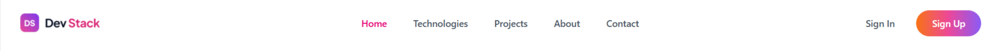
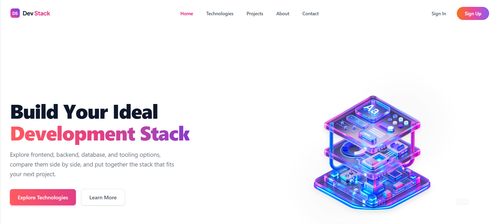
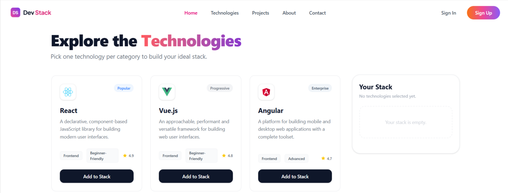
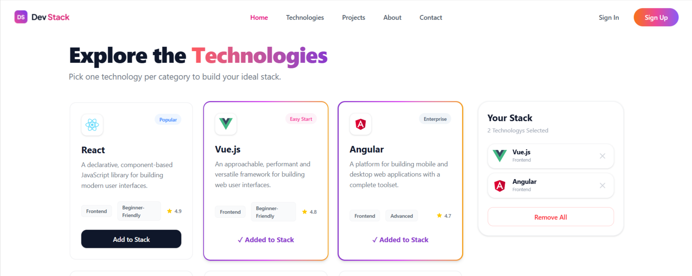
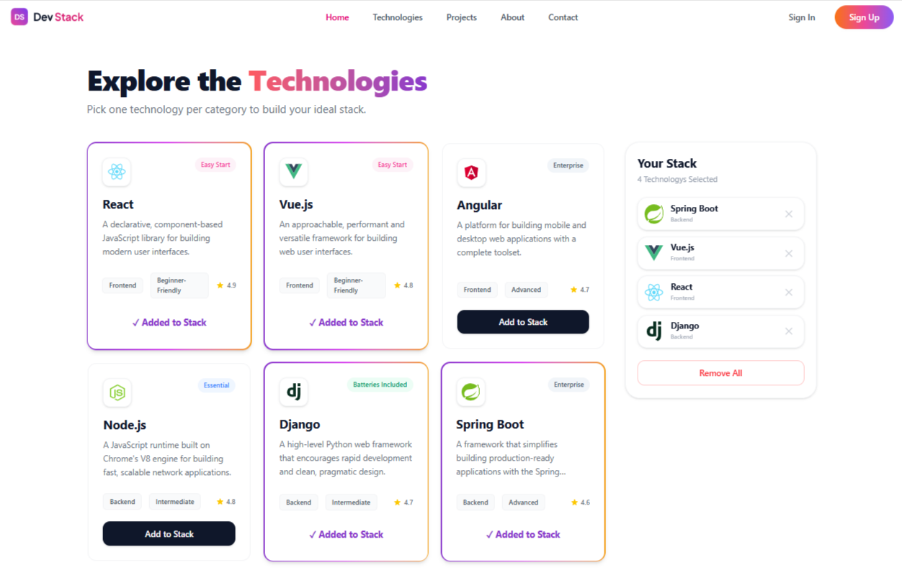
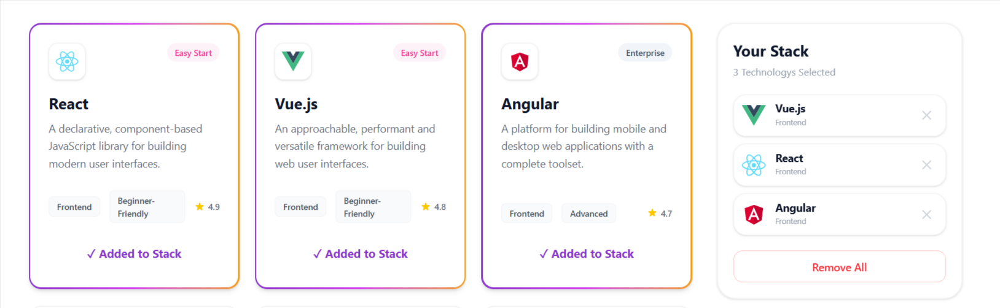
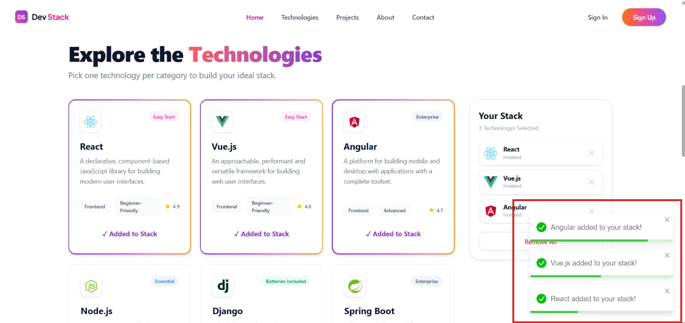

# 🧱 Dev Stack Builder

**Dev Stack Builder** is a modern, responsive web application that helps developers explore different technologies, compare tools, and build their ideal technology stack for future projects.

The project was built to practice React, TypeScript, Context API, data fetching, state management, and reusable component-based UI development.

## 🌐 Live Demo

🔗 **Netlify:**  
https://devstack-iamsahedrana.netlify.app/

# ✨ Features

- Modern and responsive user interface
- Browse technologies from an external JSON file
- Dynamic technology cards
- Add technologies to a personalized stack
- Prevent duplicate technologies
- Disable tools after they have been added
- Remove individual technologies from the stack
- Clear the entire stack
- Empty stack state
- Loading spinner while fetching data
- Toast notifications for user actions
- Interactive hover and selection effects
- Application-wide gradient theme
- Reusable React components
- Global state management with Context API

# 🛠️ Technologies Used

- React.js (Vite)
- TypeScript
- Tailwind CSS
- DaisyUI
- Context API
- React-Toastify
- JSON Data Fetching

---

# 📷 Project Sections

# 1. Navigation Bar

> Screenshot: `./Preview/navbar.png`

### Description

The navigation bar provides the main branding and navigation area of the application. It introduces the Dev Stack Builder identity and maintains a clean layout across different screen sizes.

Features include:

- Project branding
- Navigation elements
- Responsive layout
- Consistent spacing
- Tailwind CSS styling
- Clean typography

# 2. Hero Section

> Screenshot: `./Preview/hero-section.png`

### Description

The hero section introduces the purpose of Dev Stack Builder and encourages developers to explore technologies and create their own project stack.

Features include:

- Main project headline
- Supporting description
- Modern gradient styling
- Clear visual hierarchy
- Responsive content layout
- Consistent brand colors

Special attention was given to:

- Typography
- Spacing
- Background gradients
- Text alignment
- Responsive presentation

# 3. Technology Grid

> Screenshot: `./Preview/technology-grid.png`

### Description

The Technology Grid displays available development tools and technologies in reusable cards. Users can browse the available options and add technologies to their personalized stack.

Each technology card contains relevant information about the tool, such as:

- Technology logo or image
- Technology name
- Category or type
- Description
- Add-to-stack action

Features implemented:

- Dynamic JSON data fetching
- Loading state and spinner
- Reusable React components
- Responsive grid layout
- Technology card styling
- Hover effects
- Add button state management
- Duplicate prevention

React concepts practiced:

- `useState`
- `useEffect`
- Props
- `.map()`
- Unique `key` props
- Conditional rendering
- TypeScript type definitions

# 4. Technology Card

> Screenshot: `./Preview/technology-card.png`

### Description

The Technology Card is a reusable component designed to present individual technologies in a consistent and visually appealing format.

Each card provides the user with the information needed to understand and select a technology for their future project.

Features include:

- Reusable card component
- Technology information display
- Interactive hover styling
- Add-to-stack button
- Disabled state after selection
- Responsive card layout
- Consistent border radius and spacing

The card communicates with the stack management system through shared application state.

# 5. Your Stack Sidebar

> Screenshot: `./Preview/stack-sidebar.png`

### Description

The **Your Stack** sidebar allows developers to view and manage the technologies they have selected.

When a user adds a technology from the Technology Grid, it appears in the personalized stack. The sidebar updates immediately to reflect the current selections.

Features include:

- Selected technology list
- Empty Stack message
- Individual remove action
- Clear-all functionality
- Dynamic stack count
- Duplicate prevention
- Conditional rendering
- Shared state through Context API

The sidebar makes it easy for users to review their choices and modify their technology stack at any time.

# 6. Interactive Stack Selection

> Screenshot: `./Preview/stack-selection.png`

### Description

The stack selection experience provides visual feedback when users interact with technology cards.

When a technology is selected, its card can display a highlighted border while preserving the core brand color of the application. Hover effects provide additional visual feedback during exploration.

Features include:

- Technology selection
- Selected card highlighting
- Hover border effects
- Persistent selected state
- Remove and reset behavior
- Instant UI updates
- Brand-consistent visual design

This interaction improves usability by making selected technologies easy to identify.

# 7. Loading State and Notifications

> Screenshot: `./Preview/loading-and-notifications.png`

### Description

The application provides feedback during data loading and user interactions.

A loading spinner appears while technology data is being fetched. React-Toastify is used to display notifications for relevant actions, such as adding or removing technologies.

Features include:

- Loading spinner
- Data-fetching feedback
- Success notifications
- Action feedback
- Improved user experience
- Conditional rendering

# 🎨 Design Highlights

- Modern developer-focused interface
- Clean and responsive layout
- Consistent brand gradient
- Reusable technology cards
- Clear visual hierarchy
- Interactive hover and selection states
- Consistent spacing and typography
- Tailwind CSS utility-based styling
- DaisyUI components and styling utilities
- Simple and user-friendly stack management

# 📚 What I Practiced

While building this project, I practiced:

- React component structure
- TypeScript with React
- Props and state
- `useState` and `useEffect`
- Context API
- Fetching JSON data
- Loading states
- Conditional rendering
- Rendering lists with `.map()`
- Unique `key` props
- Reusable components
- Tailwind CSS
- DaisyUI
- Responsive layouts
- Event handling
- State-driven UI updates
- React-Toastify notifications
- Managing selected items
- Preventing duplicate selections

## 🛠️ Technology Used
* **Frontend Library:** React.js (Vite)
* **Styling:** Tailwind CSS + DaisyUI
* **Language:** TypeScript
* **State Management:** Context API
* **Alerts:** React-Toastify

## ✨ Key Features
1. **Dynamic JSON Fetching:** Technologies load smoothly from an external JSON file complete with a loading state/spinner for optimal UX.
2. **Intelligent Stack Management:** Users can add tools to their personalized "Your Stack" sidebar. The system prevents duplicates, instantly disables buttons upon adding, and offers individual or bulk removal capabilities.
3. **Global Theme Integration:** Implements a unified, dynamic gradient theme (`bg-brand-gradient`) allowing for instant application-wide re-theming by altering a single CSS variable.

---

## 📚 React Q&A

**1. What is JSX, and why is it used in React?**
JSX is a syntax extension for JavaScript that looks like HTML. It is used in React because it makes it much easier to write and structure the UI visually directly inside our JavaScript code without having to use complex `React.createElement()` functions.

**2. What is the difference between props and state?**
Props are read-only data passed down from a parent component to a child component to configure it. State is internal memory managed *within* a component that can change over time based on user actions, causing the component to re-render.

**3. What does the useState hook do, and where did you use it in this project?**
The `useState` hook allows a functional component to store and update data across renders. I used it in `TechGrid.tsx` to store the array of technologies fetched from the JSON file and to manage the `loading` boolean state.

**4. What does the useEffect hook do, and why did you need it to load the JSON data?**
The `useEffect` hook lets you perform side effects (like fetching data, setting timers, or subscribing to events) outside the regular component render cycle. I needed it to fetch the `technologies.json` file exactly once when the `TechGrid` component first mounted onto the screen.

**5. Why does every item in a .map() list need a unique key prop?**
React needs a unique `key` prop so it can keep track of which specific items in a list have changed, been added, or been removed. This makes UI updates highly efficient rather than re-rendering the entire list.

**6. What is conditional rendering? Show one place you used it.**
Conditional rendering is showing different UI elements based on a condition (like an `if-else` statement). I used it in `StackSidebar.tsx` to show an "Empty Stack" message if `stack.length === 0`, and the actual list of technologies if the stack had items.

**7. How do you pass data from a parent component to a child component, and how does a child send something back to the parent?**
You pass data from parent to child using `props` (like `<TechCard tech={data} />`). A child sends data back to the parent by calling a function passed down via props (or Context), such as the child calling `addToStack(tech)` which updates the parent/global state.